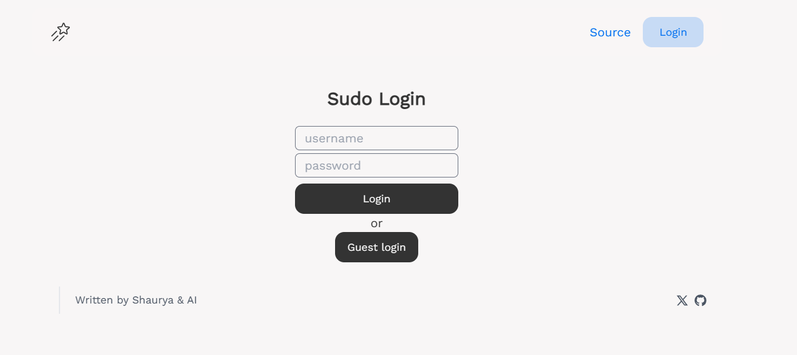

# Snip's Blog
Source code of my personal blog. I upload articles here about my experiences, daily life and share my thoughts on random topics. 🍃

### Stack
- React.js
- Next UI
- Express.js
- MongoDB + Mongoose


### Want to test?
Click on **'Guest Login'** button to get testing user and password. You wil be allowed to create, edit and delete posts but your created posts will be only visible on user profile **NOT** visible on the homepage. To view your posts go to 'Your Posts' secion from the navbar.



###  Wanna run for yourself?

Install all dependencies of `/server` and `/client` seperately. Install the Environment variables and you are good to go!

Environment variables in `server/.env`
```
DB_USER= MongoDB user (eg. cooluser)
DB_PASS= MongoDB password (eg. coolpassword)
PORT= Server Port (eg. 5000)
CLIENT_URL= Client Origin (eg. example.com)
```

Environment variables in `client/.env`
```/
VITE_SERVER= Backend endpoint (eg. api.example.com)
```
