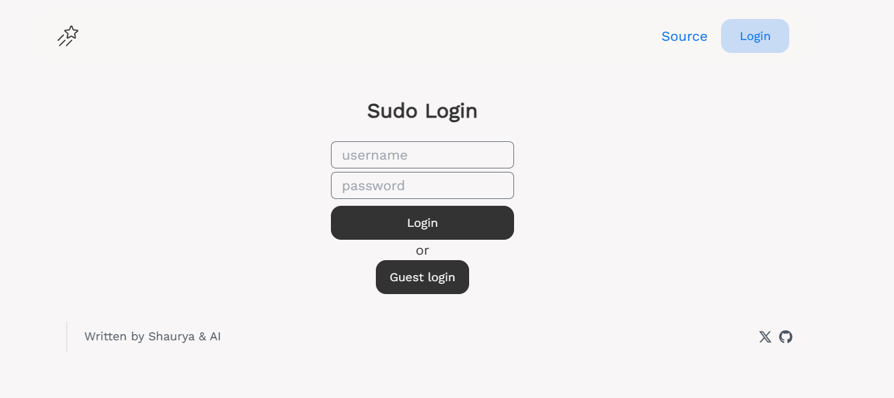

## Shaurya's Blog

My personal corner of the internet — where I used to post thoughts, goals, and occasional rant. Also happens to be the first fullstack app I ever built, so it holds a special place.

### Tech Stack

- **React.js** — frontend
- **Next UI** — components
- **Express.js** — backend
- **MongoDB + Mongoose** — database

### Try It Out

Hit the **Guest Login** button for instant access. As a guest you can create, edit, and delete posts — they'll show up under **Your Posts** in the navbar (not the homepage, to keep things tidy).





### Run Locally

Install dependencies in both `/server` and `/client` separately, then set up your env variables:

**`server/.env`**
```
DB_USER=your_mongodb_username
DB_PASS=your_mongodb_password
PORT=5000
CLIENT_URL=http://localhost:3000
```

**`client/.env`**
```
VITE_SERVER=http://localhost:5000
```

Then start both servers and you're good to go.
